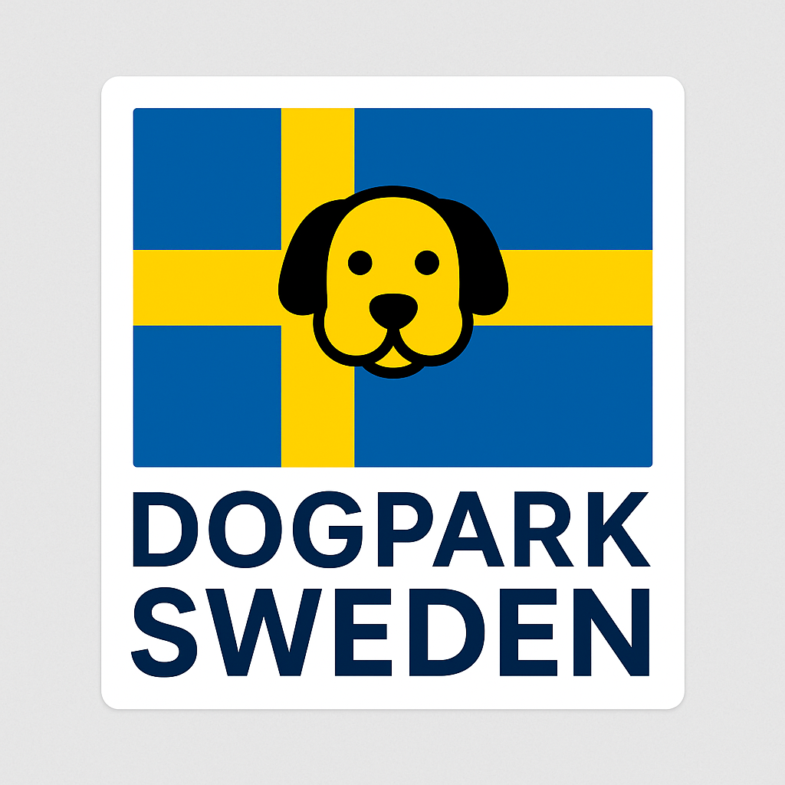
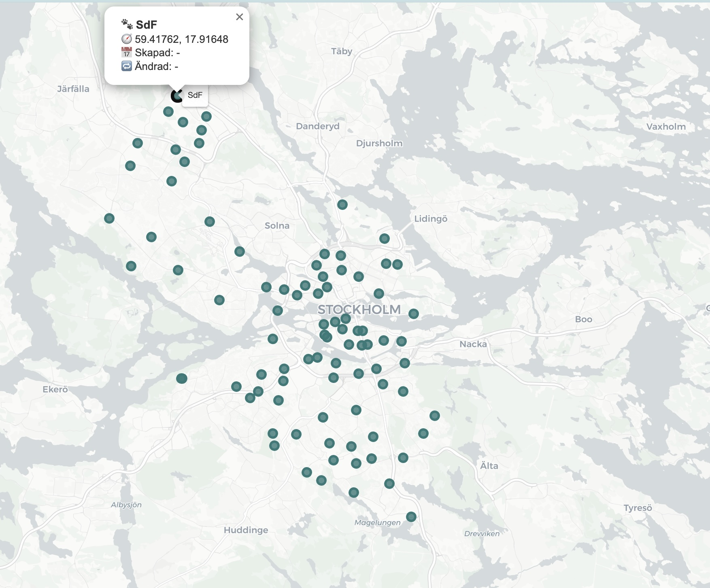
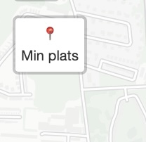
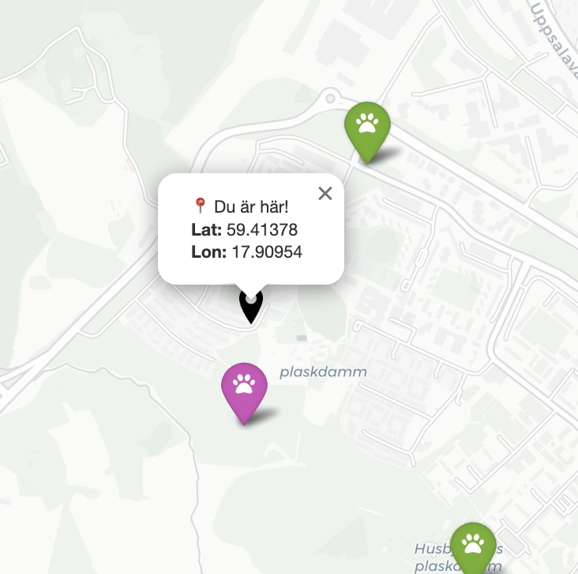
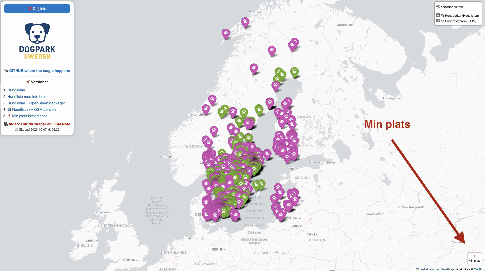
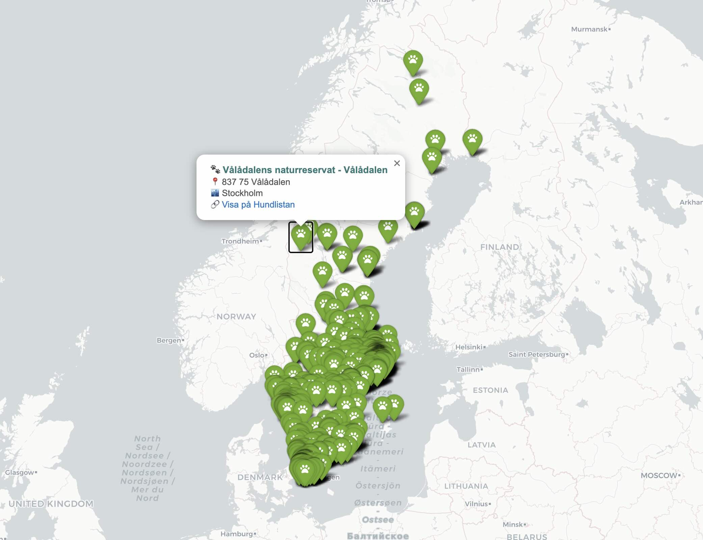
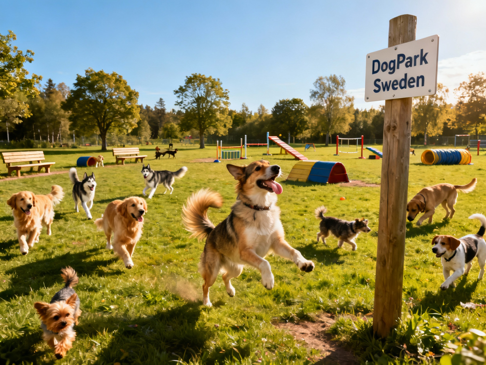

<table border=0>
<tr>
<td>

# 🐕‍🦺 Dogpark Sweden

* [tanke](https://community.dataportal.se/topic/1060/gemensam-specifikation-f%C3%B6r-hundrastg%C3%A5rd-hj%C3%A4lp-oss-f%C3%B6rb%C3%A4ttra)  
* **Video om [ChatGPT koda kartor över svenska hundparker](https://youtu.be/nvor41L9jHc)**
----
* Karta [Dogpark Sweden](https://raw.githack.com/salgo60/Dogpark_Sweden/main/notebook/hundparker_folium_snygg.html)

---
* kod [Dogpark_Sweden.ipynb](https://github.com/salgo60/Dogpark_Sweden/blob/main/notebook/Dogpark_Sweden.ipynb)
   *  

</td>
<td align="right" width="220">

</td>
</tr>
</table>
<b>Status 20251007 - Stockholm Stads öppna data</b> https://github.com/salgo60/Dogpark_Sweden/issues/10   

----
<b>Status 20251007 - Stockholm Archipelago Trail </b> https://github.com/salgo60/Dogpark_Sweden/issues/7   

----
<b>Status 20251007 - Min plats</b> https://github.com/salgo60/Dogpark_Sweden/issues/3   

----

---
<b>Status 20251006</b>  

----

