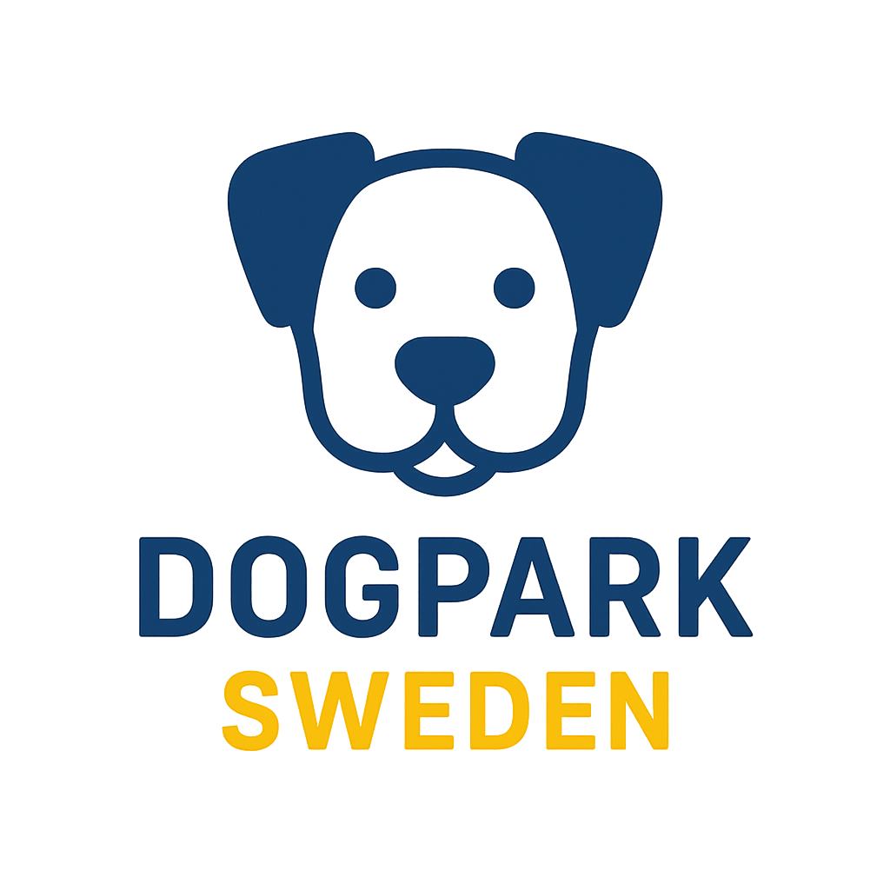

<table border=0>
<tr>
<td>

# 🐕‍🦺 Dogpark Sweden

* [tanke](https://community.dataportal.se/topic/1060/gemensam-specifikation-f%C3%B6r-hundrastg%C3%A5rd-hj%C3%A4lp-oss-f%C3%B6rb%C3%A4ttra)  
* kod [Dogpark_Sweden.ipynb](https://github.com/salgo60/Dogpark_Sweden/blob/main/notebook/Dogpark_Sweden.ipynb)
   *  
* karta [hundparker_folium_snygg.html](https://raw.githack.com/salgo60/Dogpark_Sweden/main/notebook/hundparker_folium_snygg.html)

</td>
<td align="right" width="220">

</td>
</tr>
</table>

---

----

